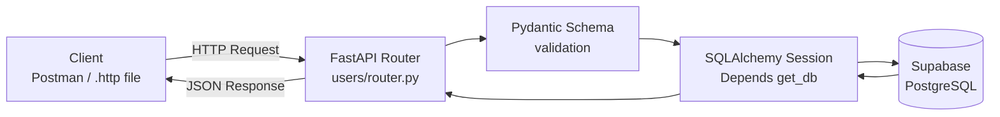
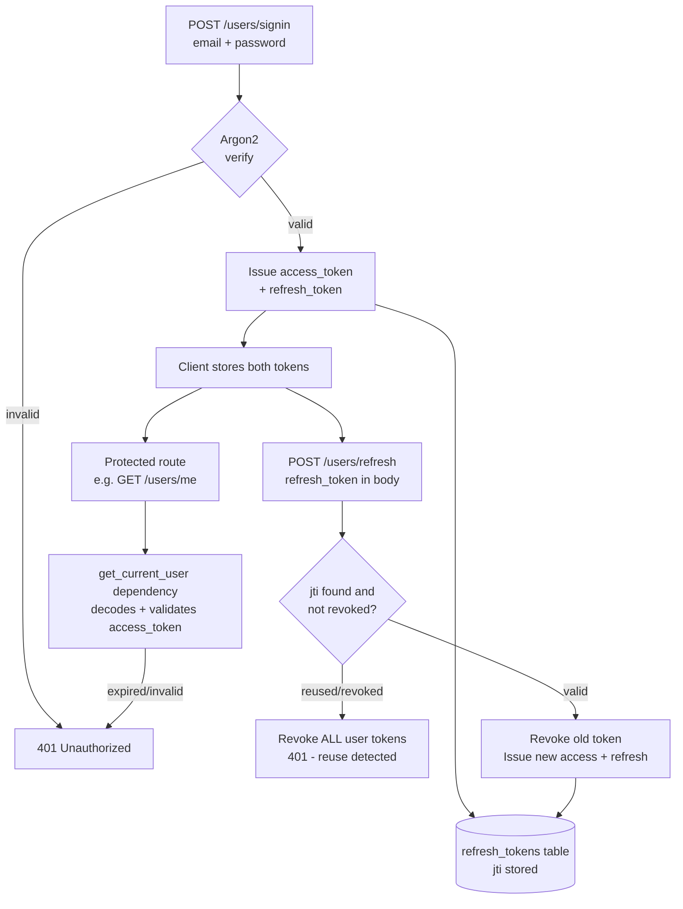
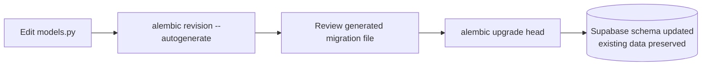

# Users API — FastAPI + SQLAlchemy + Supabase + Alembic + JWT Auth

A hands-on learning project. Building on an earlier FastAPI + SQLAlchemy +
Supabase + Alembic project, this one goes further into a real-world concern:
**authentication** — secure password storage, JWT access/refresh tokens, and
refresh token rotation with reuse detection.

🔗 **Live Demo:** [fastapi-sqlalchemy-pytest-project.onrender.com](https://fastapi-sqlalchemy-pytest-project.onrender.com/)

## Learning Goals

- ✅ Feature-based, industry-standard project structure
- ✅ Pydantic schemas for input/output validation
- ✅ SQLAlchemy ORM connected to Supabase (PostgreSQL)
- ✅ Alembic for versioned, data-safe database migrations
- ✅ Secure password hashing with Argon2
- ✅ JWT-based authentication — access tokens + refresh tokens
- ✅ Refresh token rotation with reuse detection (stateful, DB-tracked)
- ✅ Protected routes via FastAPI dependency injection
- 🔄 **PyTest test suite — implementation in progress**

## Tech Stack

| Layer | Technology |
|---|---|
| Web framework | FastAPI |
| Data validation | Pydantic |
| ORM | SQLAlchemy |
| Database | PostgreSQL (hosted on Supabase) |
| Migrations | Alembic |
| Password hashing | Argon2 (argon2-cffi) |
| Authentication | JWT (python-jose) |
| Server | Uvicorn |
| Config | python-dotenv / pydantic-settings |
| Testing | PyTest *(in progress)* |

## Architecture — Request Flow



## Architecture — Authentication Flow



## Project Structure

```
FastAPI_SQLAlchemy_PyTest_Project/
├── .env                         # secrets (gitignored)
├── .env.example
├── alembic.ini
├── alembic/
│   ├── env.py                   # Alembic ↔ SQLAlchemy models bridge
│   └── versions/                 # migration history
├── src/
│   ├── main.py                   # app entrypoint, lifespan startup checks
│   ├── core/
│   │   ├── config.py              # reads .env via Pydantic Settings
│   │   └── security.py            # JWT create/decode, JWT settings check
│   ├── db/
│   │   ├── base.py                # shared declarative Base
│   │   └── session.py             # engine, SessionLocal, get_db dependency
│   └── features/
│       └── users/
│           ├── schemas.py          # Pydantic request/response models
│           ├── models.py           # User & RefreshToken ORM models
│           ├── dependencies.py     # get_current_user (protected routes)
│           └── router.py           # signup / signin / refresh / CRUD endpoints
└── test_main.http               # manual endpoint tests
```

## Database Schema

**`users` table**

| Column | Type | Constraint |
|---|---|---|
| `id` | Integer | Primary Key |
| `email` | String | Unique, Not Null |
| `username` | String | Unique, Not Null |
| `hashed_password` | String | Not Null (Argon2 hash) |
| `full_name` | String | Nullable |
| `is_active` | Boolean | Not Null, default `true` |
| `is_verified` | Boolean | Not Null, default `false` |
| `created_at` | DateTime (tz) | Not Null, server-generated |
| `updated_at` | DateTime (tz) | Not Null, auto-updated |

**`refresh_tokens` table**

| Column | Type | Constraint |
|---|---|---|
| `id` | Integer | Primary Key |
| `jti` | String | Unique, Not Null |
| `user_id` | Integer | Foreign Key → `users.id`, cascade delete |
| `expires_at` | DateTime (tz) | Not Null |
| `revoked` | Boolean | Not Null, default `false` |
| `created_at` | DateTime (tz) | Not Null, server-generated |

## API Endpoints

| Method | Path | Auth Required | Description |
|---|---|---|---|
| `POST` | `/users/signup` | No | Register a new user |
| `POST` | `/users/signin` | No | Log in, receive access + refresh tokens |
| `POST` | `/users/refresh` | No *(refresh token in body)* | Rotate tokens |
| `GET` | `/users/me` | Yes | Get the current authenticated user |
| `GET` | `/users/all` | No | List all users |
| `GET` | `/users/{user_id}` | No | Get a single user |
| `PUT` | `/users/update/{user_id}` | No | Update a user |
| `DELETE` | `/users/delete/{user_id}` | No | Delete a user |

Interactive docs available at `/docs` (Swagger UI) and `/redoc` (ReDoc) once
the server is running.

## Migration Workflow



## Running Locally

1. Create and activate a virtual environment.
2. Install dependencies: `fastapi[standard]`, `sqlalchemy`, `psycopg2-binary`,
   `python-dotenv`, `pydantic-settings`, `alembic`, `argon2-cffi`,
   `python-jose[cryptography]`.
3. Create a `.env` file with the Supabase (Session pooler) connection string
   and JWT settings (`SECRET_KEY`, `ALGORITHM`, token expiry values).
4. Run the latest migrations: `alembic upgrade head`.
5. Start the dev server: `uvicorn src.main:app --reload`.
6. Test via `/docs`, Postman, or the included `.http` file.

## Status

✅ **Core CRUD and authentication complete** — signup, signin, JWT access &
refresh tokens with rotation and reuse detection, and a protected route are
all implemented and manually tested.

🔄 **PyTest test suite implementation is currently in progress.**

## Possible Future Enhancements

- Logout endpoint (explicit refresh token revocation)
- Scheduled cleanup of expired/revoked refresh tokens
- Service / repository layer separation
- Centralized exception handling
- Role-based authorization (admin vs. regular user)

---

## 👤 Author

- **[Mohammad Zahid Kamal]** *Full Stack AI Enthusiast & Developer*
- *LinkedIn* [https://www.linkedin.com/in/md-zahid-kamal/]
- *Portfolio* [https://md-zahid-kamal.vercel.app/]

---

*Developed with ❤️ as part of an AI Exploration Project.*
